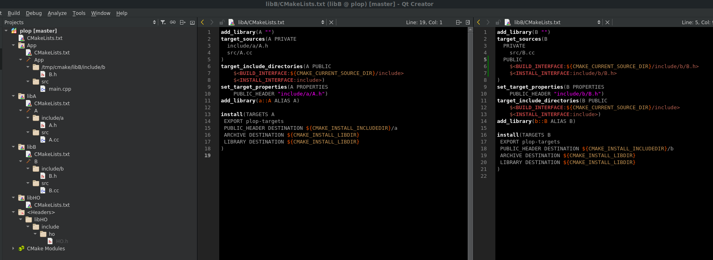

[](https://travis-ci.com/Mizux/plop)
# Introduction
Test C++/CMake IDE integration with `INTERFACE` library and library having `target_sources( PUBLIC ....`

# Build/Install
```shell
$ cmake -H. -Bbuild
$ cmake --build build
```
To test install
```shell
$ cmake --build build --target install -- DESTDIR=install
...
Install the project...
/usr/local/google/home/corentinl/cmake/bin/cmake -P cmake_install.cmake
-- Install configuration: ""
-- Installing: install/usr/local/lib/cmake/plop/plop-targets.cmake
-- Installing: install/usr/local/lib/cmake/plop/plop-targets-noconfig.cmake
-- Installing: install/usr/local/lib/cmake/plop/plop-config.cmake
-- Installing: install/usr/local/lib/cmake/plop/plop-config-version.cmake
-- Installing: install/usr/local/lib/libA.so
-- Installing: install/usr/local/include/a/A.h
-- Installing: install/usr/local/lib/libB.so
-- Installing: install/usr/local/include/b/B.h
-- Installing: install/usr/local/include/ho/HO.h
-- Installing: install/usr/local/bin/App
-- Set runtime path of "install/usr/local/bin/App" to ""
```

# QtCreator
`libA` use only `PRIVATE` sources while `libB` use `PUBLIC` for headers.



We can see for `App`, `libB` headers are listed.
